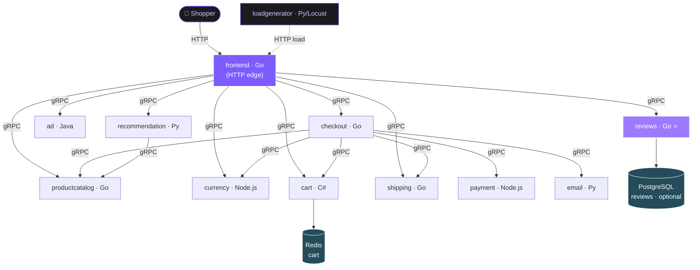

<h1 align="center">🛍️ VANTA Boutique</h1>

<p align="center">
  <strong>Curated for the Bold</strong> — a premium, dark-themed cloud-native e-commerce store
  built on a polyglot microservices architecture.
</p>

<p align="center">
  <a href="#-architecture"></a>
  <a href="#-tech-stack"></a>
  <a href="/kustomize"></a>
  <a href="/.github/workflows"></a>
  
</p>

---

## Overview

**VANTA Boutique** is a web-based storefront where shoppers browse a curated catalog,
read and write **product reviews**, manage a cart, and check out — all served by **12
independent microservices** written in **six languages** (Go, C#, Node.js, Python, Java)
that communicate over **gRPC**.

It began as a fork of Google's *Online Boutique* and was rebuilt into a production-leaning
DevOps showcase: a **brand-new Reviews microservice** taken end-to-end (proto → service →
container → Kubernetes → CI/CD), a restyled **VANTA** storefront, and an automated delivery
pipeline that builds, tests, scans, and ships every service.

### What this fork adds on top of the upstream demo

- 🆕 **Reviews microservice** (`reviewsservice`, Go/gRPC) — `GetReviews` + `AddReview`, with a
  pluggable **`Store` interface**: a bounded, concurrency-safe **in-memory** store by default,
  or a durable, shared **PostgreSQL** store (pgx/v5) for multi-replica deployments.
- 🎨 **VANTA storefront** — reviews on the product page (★ ratings, write-a-review form),
  rendered with accessibility (`aria-label`, semantic `<article>`/`<time>`) and **schema.org
  JSON-LD** (`AggregateRating`/`Review`) for rich search snippets.
- 🛡️ **Production hardening** — graceful shutdown (`SIGTERM` → drain), gRPC message-size &
  keepalive limits, input validation/length caps, DB-connectivity-driven **gRPC health**, a
  `nonroot` distroless image, and a dedicated **NetworkPolicy**.
- ⚙️ **CI/CD** — GitHub Actions: `go vet`, **race-detector tests** with a Postgres service
  container, multi-service Docker builds, Trivy vulnerability scan, and an honest deploy gate.
- ☸️ **GitOps-ready deploy** — Kustomize base + `dev` overlay, an opt-in
  `reviews-persistence` component (Postgres + PVC + secret), runnable on **local kind** or a
  remote **AWS EC2** cluster via ArgoCD.

## Screenshots

| Landing — *Curated for the Bold* | Catalog — *Hot Products* |
| --- | --- |
|  |  |

| Product detail | Cart & checkout | Order confirmed |
| --- | --- | --- |
|  |  |  |

## 🏗 Architecture

VANTA Boutique is a **gRPC mesh**: the Go **frontend** is the single HTTP edge, and every
other service is an internal gRPC backend. Services are **stateless** and horizontally
scalable; state lives in two backing stores — **Redis** (cart) and an optional
**PostgreSQL** (reviews). The **checkout** service acts as the orchestrator, fanning out to
cart, catalog, currency, shipping, payment, and email to complete an order. Contracts are
defined once as **Protocol Buffers** in [`./protos`](/protos) and code-generated per language.



> **Telemetry:** services also emit traces/metrics to an optional OpenTelemetry collector
> (`COLLECTOR_SERVICE_ADDR`), and a Gemini-powered shopping-assistant can be enabled via
> [Kustomize components](/kustomize). Both are omitted above to keep the request path clear.

| Service | Language | Description |
| --- | --- | --- |
| [frontend](/src/frontend) | Go | HTTP server for the website; auto-generates a session for every visitor (no login). Renders the reviews UI. |
| [reviewsservice](/src/reviewsservice) ⭐ | Go | **New in VANTA.** Serves product reviews & aggregate ratings over gRPC; in-memory or PostgreSQL store. |
| [cartservice](/src/cartservice) | C# | Stores cart items in Redis and retrieves them. |
| [productcatalogservice](/src/productcatalogservice) | Go | Provides the product list, search, and individual product lookups. |
| [currencyservice](/src/currencyservice) | Node.js | Converts money between currencies (ECB rates). Highest-QPS service. |
| [paymentservice](/src/paymentservice) | Node.js | Charges the (mock) credit card and returns a transaction ID. |
| [shippingservice](/src/shippingservice) | Go | Estimates shipping cost and ships the order (mock). |
| [emailservice](/src/emailservice) | Python | Sends the order-confirmation email (mock). |
| [checkoutservice](/src/checkoutservice) | Go | Orchestrates cart retrieval, payment, shipping, and email. |
| [recommendationservice](/src/recommendationservice) | Python | Recommends products based on cart contents. |
| [adservice](/src/adservice) | Java | Serves contextual text ads. |
| [loadgenerator](/src/loadgenerator) | Python/Locust | Continuously simulates realistic shopping traffic. |

> Backing stores: **Redis** (cart) and an optional **PostgreSQL** (reviews, via the
> `reviews-persistence` component).

## 🚀 Run it locally (kind)

The quickest way to see the full store on your machine — a local
[kind](https://kind.sigs.k8s.io/) cluster, no cloud account required.

```sh
# 1. Create a local cluster (maps NodePort 30080 → host 8888)
kind create cluster --config kind-local.yaml

# 2. Deploy the dev overlay (all 12 services + Redis)
kubectl apply -k kustomize/overlays/dev

# 3. Wait for everything to be Ready
kubectl wait --for=condition=ready pod --all --timeout=300s

# 4. Open the store
#    NodePort:      http://localhost:8888
#    or port-forward (more robust):
kubectl port-forward --address 0.0.0.0 svc/frontend-external 8088:80
#    → http://localhost:8088
```

**Build from source** instead of pulling images, then load into kind:

```sh
docker build -t reviewsservice:dev src/reviewsservice
docker build -t frontend:dev      src/frontend
kind load docker-image reviewsservice:dev frontend:dev --name boutique
kubectl set image deployment/reviewsservice server=reviewsservice:dev
kubectl set image deployment/frontend       server=frontend:dev
```

To enable the durable **PostgreSQL** reviews store, add the component to
`kustomize/overlays/dev/kustomization.yaml`:

```yaml
components:
  - ../../components/reviews-persistence
```

> ☁️ For **GKE**, **AWS EC2 (ArgoCD)**, Terraform, Helm, and Istio options, see
> [`/kustomize`](/kustomize), [`/terraform`](/terraform), and the
> [development guide](/docs/development-guide.md).

## 🧰 Tech stack

- **Languages:** Go · C# · Node.js · Python · Java
- **Comms:** gRPC + Protocol Buffers · gRPC health protocol
- **Data:** Redis (cart) · PostgreSQL / pgx (reviews)
- **Packaging:** Multi-stage Docker, `distroless:nonroot`
- **Orchestration:** Kubernetes · Kustomize (base + overlays + components)
- **CI/CD:** GitHub Actions (vet, `-race` tests, Postgres service container, Trivy) · ArgoCD (GitOps)
- **Frontend extras:** schema.org JSON-LD · accessible review components

## 📚 Documentation

- [Development guide](/docs/development-guide.md) — run and develop locally.
- [Reviews service](/src/reviewsservice/README.md) — API, storage modes, and configuration.
- [Adding a new microservice](/docs/adding-new-microservice.md).

## Credits & license

VANTA Boutique is built on Google's [Online Boutique](https://github.com/GoogleCloudPlatform/microservices-demo)
sample and is licensed under **Apache-2.0** (see [`LICENSE`](/LICENSE)). The Reviews
microservice, VANTA storefront, and CI/CD pipeline are additions by this project.
