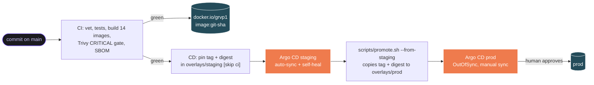
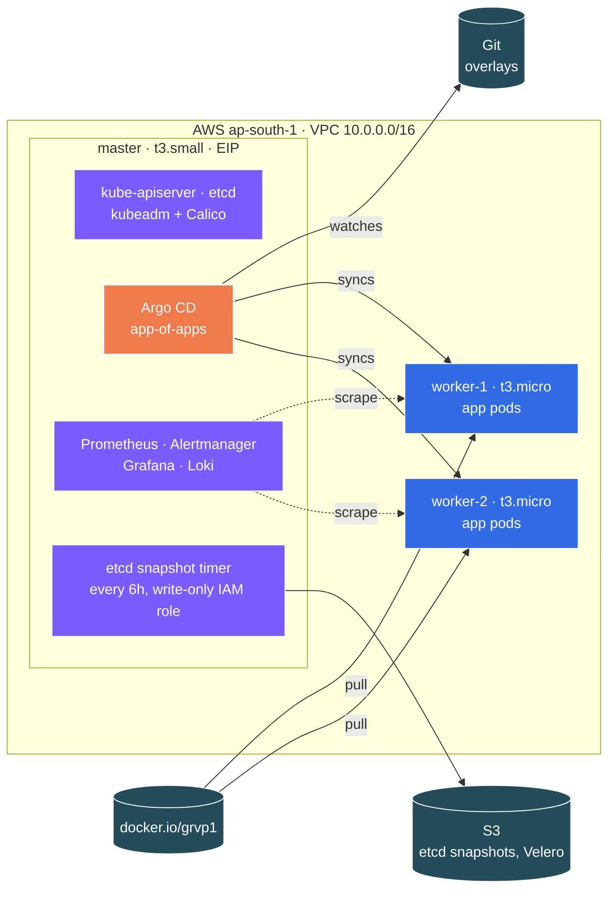
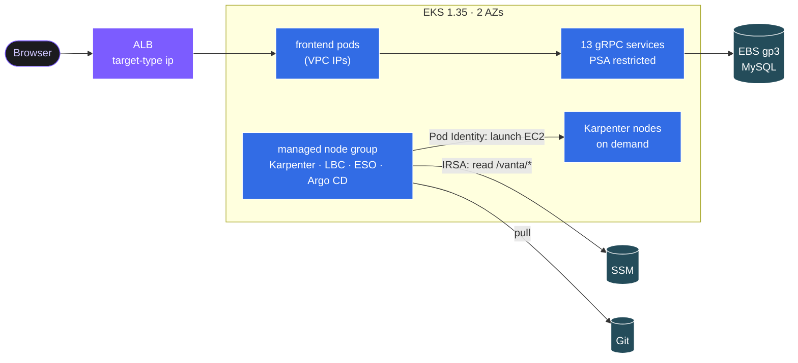

<h1 align="center">VANTA Boutique</h1>

<p align="center">
  <strong>Curated for the Bold.</strong> A dark-themed e-commerce storefront on a polyglot gRPC
  microservices app, with the complete delivery platform around it: Terraform, kubeadm and EKS,
  Argo CD, GitHub Actions, Prometheus. Everything is code.
</p>

<p align="center">
  <a href="#architecture"></a>
  <a href="#architecture"></a>
  <a href="#deployment-targets"></a>
  <a href="/terraform"></a>
  <a href="/argocd"></a>
  <a href="/monitoring"></a>
  <a href="/.github/workflows"></a>
  
</p>

---

## What this is

VANTA Boutique started as a fork of Google's [Online Boutique](https://github.com/GoogleCloudPlatform/microservices-demo)
demo. The application is theirs; the platform around it is the work in this repo:

- **Three new services** written from scratch in Go: reviews (MySQL-backed), wishlist, inventory.
- **A rebuilt storefront**: rupee-first pricing, 25-product catalog with search/filter/sort, stock
  states, product reviews with ratings, wishlist, real product photography.
- **A delivery platform defined in code**: every push is tested, built, scanned and given an SBOM;
  images are promoted by digest through Git; Argo CD deploys; Prometheus alerts on an SLO.
  See [Platform](#platform).
- **Two deployment targets from the same base**: a self-managed kubeadm cluster on EC2 and Amazon
  EKS, both provisioned with Terraform and both run and tested. See
  [Deployment targets](#deployment-targets).

The storefront is 14 services in five languages (Go, C#, Node.js, Python, Java) talking gRPC.

## Screenshots

| Landing | Catalog: 25 products, 6 categories, filter/search/sort | Product detail with reviews |
| --- | --- | --- |
|  |  |  |

| Sold-out state | Cart and checkout | Order confirmed |
| --- | --- | --- |
|  |  |  |

## Architecture

The Go **frontend** is the only HTTP edge; every other service is an internal gRPC backend.
Services are stateless and scale horizontally. State lives in two stores: **Redis** for the
cart and an optional **MySQL** for reviews. **checkout** orchestrates an order by fanning out to
cart, catalog, currency, shipping, payment and email. Contracts are Protocol Buffers in
[`/protos`](/protos), generated per language.


```mermaid
flowchart TD
    user([Shopper]):::ext
    lg[loadgenerator<br/>Python / Locust]:::ext

    user -->|HTTP| fe
    lg -. synthetic traffic .-> fe

    fe["frontend (Go)<br/>HTTP edge, sessions, templates"]:::edge

    fe -->|gRPC| pc[productcatalog · Go]
    fe -->|gRPC| cur[currency · Node.js]
    fe -->|gRPC| cart[cart · C#]
    fe -->|gRPC| rec[recommendation · Python]
    fe -->|gRPC| ship[shipping · Go]
    fe -->|gRPC| ad[ad · Java]
    fe -->|gRPC| rev["reviews · Go (new)"]:::new
    fe -->|gRPC| wish["wishlist · Go (new)"]:::new
    fe -->|gRPC| inv["inventory · Go (new)"]:::new
    fe -->|gRPC| co[checkout · Go]

    co -->|gRPC| cart
    co -->|gRPC| pc
    co -->|gRPC| cur
    co -->|gRPC| ship
    co -->|gRPC| pay[payment · Node.js]
    co -->|gRPC| email[email · Python]

    rec -->|gRPC| pc

    cart --> redis[("Redis<br/>cart")]:::store
    rev --> mysql[("MySQL<br/>reviews, optional")]:::store

    classDef edge  fill:#7c5cff,stroke:#fff,color:#fff;
    classDef new   fill:#9d7bff,stroke:#fff,color:#fff,stroke-width:2px;
    classDef store fill:#244c5a,stroke:#fff,color:#fff;
    classDef ext   fill:#1b1b1f,stroke:#7c5cff,color:#cfc6ff;
```

Tracing to an OpenTelemetry collector is optional (`COLLECTOR_SERVICE_ADDR`, the `tracing`
Kustomize component) and is left out of the diagram to keep the request path readable.

| Service | Language | Role |
| --- | --- | --- |
| [frontend](/src/frontend) | Go | HTTP server for the store; a session per visitor, no login. Renders reviews, wishlist and stock. |
| [reviewsservice](/src/reviewsservice) | Go | **New.** Product reviews and aggregate ratings over gRPC. In-memory store by default, MySQL for multi-replica deployments, behind a `Store` interface. |
| [wishlistservice](/src/wishlistservice) | Go | **New.** Saved items keyed by session, so the list survives a cleared browser. Bounded per user and in total; the frontend falls back to `localStorage` when it is not deployed. |
| [inventoryservice](/src/inventoryservice) | Go | **New.** Stock levels behind "In stock", "Only 3 left" and "Sold out". Seeded from a built-in table or a mounted ConfigMap. |
| [cartservice](/src/cartservice) | C# | Cart items in Redis. |
| [productcatalogservice](/src/productcatalogservice) | Go | Product list, search, lookups. |
| [currencyservice](/src/currencyservice) | Node.js | Currency conversion (ECB rates). Highest QPS. |
| [paymentservice](/src/paymentservice) | Node.js | Mock card charge, returns a transaction ID. |
| [shippingservice](/src/shippingservice) | Go | Mock shipping quote and shipment. |
| [emailservice](/src/emailservice) | Python | Mock order-confirmation email. |
| [checkoutservice](/src/checkoutservice) | Go | Orchestrates cart, payment, shipping and email. |
| [recommendationservice](/src/recommendationservice) | Python | Recommendations from cart contents. |
| [adservice](/src/adservice) | Java | Contextual text ads. |
| [loadgenerator](/src/loadgenerator) | Python / Locust | Continuous synthetic shopping traffic. |

What the new services carry beyond the demo: graceful shutdown on `SIGTERM`, gRPC message-size
and keepalive limits, input validation and length caps, DB-connectivity-driven gRPC health,
`distroless:nonroot` images, and a NetworkPolicy each. The cloud-provider SDKs the upstream
demo shipped with (Cloud Profiler, GCE metadata detection, AlloyDB/Spanner/Secret Manager
stores) were removed from all services; every image is built here and runs from this repo's
registry namespace (`docker.io/grvp1`).

## Platform

Nothing is clicked in a console. The pieces in this section are defined once and are the same
whichever cluster runs the store; what differs per cluster is under
[Deployment targets](#deployment-targets).

**Release path.** Staging is automatic; prod needs a human. Rollback in either is `git revert`.


```mermaid
flowchart LR
    c([commit on main]):::ext --> ci["CI: vet, tests, build 14 images,<br/>Trivy CRITICAL gate, SBOM"]
    ci -->|green| reg[("docker.io/grvp1<br/>image:git-sha")]:::store
    ci -->|green| cd["CD: pin tag + digest<br/>in overlays/staging [skip ci]"]
    cd --> st["Argo CD staging<br/>auto-sync + self-heal"]:::argo
    st --> pr["scripts/promote.sh --from-staging<br/>copies tag + digest to overlays/prod"]
    pr --> ps["Argo CD prod<br/>OutOfSync, manual sync"]:::argo
    ps -->|human approves| prod[("prod")]:::store

    classDef argo  fill:#ef7b4d,stroke:#fff,color:#fff;
    classDef store fill:#244c5a,stroke:#fff,color:#fff;
    classDef ext   fill:#1b1b1f,stroke:#7c5cff,color:#cfc6ff;
```

| Layer | What is here | Where |
| --- | --- | --- |
| CI/CD | GitHub Actions: vet and unit tests (reviews with `-race` against a MySQL service container), all 14 images, Trivy CRITICAL gate, a CycloneDX SBOM per image, Kustomize and Helm render checks, `terraform validate` | [`/.github/workflows`](/.github/workflows) |
| Images | Built here, tagged with the git SHA and pinned by digest in staging and prod, so prod runs the exact bytes staging ran | [`scripts/bump-image-tags.sh`](/scripts/bump-image-tags.sh) |
| GitOps | Argo CD pulls from Git; CI never holds cluster credentials | [`/argocd`](/argocd), [`scripts/promote.sh`](/scripts/promote.sh) |
| Manifests | Kustomize base, overlays per environment and cluster (`dev`, `staging`, `prod`, `eks`), components (ingress, TLS, network policies, PDBs, persistence, tracing) | [`/kustomize`](/kustomize) |
| Observability | kube-prometheus-stack, 11 alert rules including a 99.5% availability SLO with multi-window burn-rate alerts, Alertmanager to Slack by severity, a Grafana dashboard, Loki | [`/monitoring`](/monitoring) |
| Security | RBAC, default-deny NetworkPolicies with per-service allow lists, non-root distroless images, the image scan gate, no secrets in Git | [`components/network-policies`](/kustomize/components/network-policies) |
| Resilience | HPA, PodDisruptionBudgets, chaos and node-failover drills with runbooks | [`/scripts`](/scripts), [`docs/RUNBOOKS.md`](/docs/RUNBOOKS.md) |
| Packaging | A Helm chart as an alternative to the overlays, validated in CI | [`/helm-chart`](/helm-chart) |

## Deployment targets

The same Kustomize base and images run on two clusters. kubeadm came first, to work with the
control plane directly (certificates, etcd, CNI, StorageClass); EKS reuses everything above with
a managed control plane and IAM-native access. The trade-offs are in
[docs/DECISIONS.md](/docs/DECISIONS.md).

| | Self-managed kubeadm on EC2 | Amazon EKS |
| --- | --- | --- |
| Terraform | [`/terraform`](/terraform): VPC, 1 master + 2 workers, EIP, security groups, an IAM role for etcd backups | [`/terraform-eks`](/terraform-eks): community VPC and EKS modules, EKS 1.35 held in standard support, API-only access entries |
| Control plane | kubeadm via [Ansible](/ansible); certificates, etcd and upgrades are ours | AWS-managed across three AZs |
| Nodes | fixed workers | a managed node group (AL2023, IMDSv2) as the base, [Karpenter](/karpenter) for the rest |
| Networking | Calico overlay | VPC CNI with prefix delegation (110 pods per node) |
| Entry | nginx Ingress with rate limits and timeouts, cert-manager TLS | ALB through the AWS Load Balancer Controller, target-type ip, pod readiness gates |
| Storage | local-path | EBS gp3 through the CSI driver |
| Secrets | the demo Secret in the persistence component | External Secrets Operator from SSM Parameter Store |
| Pod security | Pod Security admission | the namespace enforces `restricted`, RuntimeDefault seccomp |
| Pod to AWS | etcd backup uses a write-only node instance role | IRSA per controller, Pod Identity for Karpenter, instance metadata blocked for pods |
| Observability | kube-prometheus-stack, Loki, the SLO alerts | not deployed yet |
| Backup and DR | etcd snapshots to S3 every 6 hours, Velero file-system backups, restore drill | etcd is AWS-managed; Git is the source of truth |
| Argo CD | root app-of-apps (`argocd/apps/*`) | `argocd/eks/application.yaml`, manual sync |
| Tested | self-heal of a manual change, `git revert` rollback, etcd snapshot restore | Karpenter scale-out, HPA under load, node drain under live traffic with 249/249 requests served |
| Cost | about $1.5/day | about $0.35-0.40/hr while running, destroyed after each session |
| Runbook | [docs/PLATFORM.md](/docs/PLATFORM.md) | [docs/EKS.md](/docs/EKS.md) |

### Self-managed on EC2


```mermaid
flowchart LR
    git[("Git<br/>overlays")]:::store
    reg[("docker.io/grvp1")]:::store
    s3[("S3<br/>etcd snapshots, Velero")]:::store

    subgraph aws["AWS ap-south-1 · VPC 10.0.0.0/16"]
      direction TB
      subgraph master["master · t3.small · EIP"]
        api["kube-apiserver · etcd<br/>kubeadm + Calico"]:::edge
        argo["Argo CD<br/>app-of-apps"]:::argo
        obs["Prometheus · Alertmanager<br/>Grafana · Loki"]:::edge
        snap["etcd snapshot timer<br/>every 6h, write-only IAM role"]:::edge
      end
      w1["worker-1 · t3.micro<br/>app pods"]:::node
      w2["worker-2 · t3.micro<br/>app pods"]:::node
    end

    argo -->|watches| git
    argo -->|syncs| w1
    argo -->|syncs| w2
    reg -->|pull| w1
    reg -->|pull| w2
    obs -.->|scrape| w1
    obs -.->|scrape| w2
    snap --> s3

    classDef edge  fill:#7c5cff,stroke:#fff,color:#fff;
    classDef argo  fill:#ef7b4d,stroke:#fff,color:#fff,stroke-width:2px;
    classDef node  fill:#326ce5,stroke:#fff,color:#fff;
    classDef store fill:#244c5a,stroke:#fff,color:#fff;
```

### Amazon EKS


```mermaid
flowchart LR
    user([Browser]):::ext --> alb["ALB<br/>target-type ip"]:::edge
    alb --> pods["frontend pods<br/>(VPC IPs)"]
    subgraph eks["EKS 1.35 · 2 AZs"]
      pods --> be["13 gRPC services<br/>PSA restricted"]
      mng["managed node group<br/>Karpenter · LBC · ESO · Argo CD"]:::node
      kp["Karpenter nodes<br/>on demand"]:::node
    end
    mng -->|Pod Identity: launch EC2| kp
    mng -->|IRSA: read /vanta/*| ssm[("SSM")]:::store
    mng -->|pull| git[("Git")]:::store
    be --> ebs[("EBS gp3<br/>MySQL")]:::store

    classDef edge  fill:#7c5cff,stroke:#fff,color:#fff;
    classDef node  fill:#326ce5,stroke:#fff,color:#fff;
    classDef store fill:#244c5a,stroke:#fff,color:#fff;
    classDef ext   fill:#1b1b1f,stroke:#7c5cff,color:#cfc6ff;
```

Both tear down with `terraform destroy`; on EKS delete the Karpenter NodePool and the Argo CD
Application first (the order is in [docs/EKS.md](/docs/EKS.md#teardown)). State, kubeconfig,
tfvars and credentials are git-ignored.

## Run it locally (kind)

A local [kind](https://kind.sigs.k8s.io/) cluster runs the whole store with no cloud account.

```sh
# 1. cluster (NodePort 30080 -> host 8888; 80/443 for the optional Ingress)
kind create cluster --config kind-local.yaml            # make kind-up

# 2. dev overlay: namespace `boutique`, all 14 services + Redis
kubectl apply -k kustomize/overlays/dev                 # make deploy
kubectl wait -n boutique --for=condition=ready pod --all --timeout=300s

# 3. open the store
#    http://localhost:8888          (NodePort)
kubectl port-forward -n boutique svc/frontend 8088:80   # or http://localhost:8088
```

With the real entry path (nginx Ingress and rate limits, as in prod):

```sh
scripts/install-ingress-nginx.sh --provider kind        # make ingress
kubectl apply -k kustomize/overlays/kind-ingress
echo "127.0.0.1 vanta.local" | sudo tee -a /etc/hosts    # http://vanta.local
```

Build a service from source and load it into kind:

```sh
docker build -t docker.io/grvp1/reviewsservice:dev src/reviewsservice
kind load docker-image docker.io/grvp1/reviewsservice:dev --name boutique
kubectl set image -n boutique deployment/reviewsservice server=docker.io/grvp1/reviewsservice:dev
```

To run reviews on MySQL instead of in memory, add the component to
`kustomize/overlays/dev/kustomization.yaml`:

```yaml
components:
  - ../../components/reviews-persistence
```

If you are upgrading a deployment that used the earlier PostgreSQL store, read
[the MySQL migration guide](docs/REVIEWS_MYSQL_MIGRATION.md) first; the image and the database
configuration have to be cut over together.

## Repository map

```
.github/workflows/   ci-pipeline, cd-pipeline, kustomize/helm/terraform validation, deps-bump
ansible/             playbook.yml (kubeadm init/join + Calico), audit-playbook.yml
argocd/              root.yaml (app-of-apps) · apps/{dev,staging,prod}.yaml · eks/application.yaml
backup/              Velero install and example credentials file
docs/                PLATFORM · EKS · RUNBOOKS · DECISIONS · development guide · migration guides
helm-chart/          alternative packaging, linted and rendered in CI
karpenter/           EC2NodeClass + NodePool for the EKS cluster
kustomize/           base/ (14 services) · components/ · overlays/{dev,staging,prod,eks,local,kind-ingress} · tests/
monitoring/          kube-prometheus-stack, Loki and ingress-nginx values; Grafana dashboard; alert rules
protos/              gRPC contracts (demo.proto, health)
scripts/             setup-argocd, install-ingress-nginx, promote, bump-image-tags, etcd-backup-setup,
                     failover-lab, chaos-engineering, health-check, eks-addons
src/                 14 services, one directory each, with Dockerfile and README
terraform/           kubeadm cluster on EC2        terraform-eks/   EKS cluster
```

## Documentation

**Run a cluster**

- [Platform runbook](/docs/PLATFORM.md): the kubeadm cluster on AWS, from Terraform to GitOps, observability and day-2.
- [EKS runbook](/docs/EKS.md): the tested EKS build step by step, results, problems found, teardown order.
- [Runbooks](/docs/RUNBOOKS.md): crash loops, rollback, node failover, DB down, SLO burn, TLS, restore drill.

**Understand the choices**

- [Decisions](/docs/DECISIONS.md): GitOps, SHA tags and digests, scan gates, network policies, SLOs, kubeadm, and the EKS choices (Karpenter, External Secrets, IRSA vs Pod Identity).
- [How this was built](/docs/learning-journey.md): minikube to a 3-node cluster on AWS.

**Work on the code**

- [Development guide](/docs/development-guide.md), [CI/CD workflows](/.github/workflows/README.md), [Kustomize layout](/kustomize/README.md), [Helm chart](/helm-chart/README.md), [Monitoring](/monitoring/README.md)
- [Reviews](/src/reviewsservice/README.md), [Wishlist](/src/wishlistservice/README.md), [Inventory](/src/inventoryservice/README.md) service READMEs
- [Adding a new microservice](/docs/adding-new-microservice.md), with reviewsservice as the worked example
- [Reviews: PostgreSQL to MySQL](/docs/REVIEWS_MYSQL_MIGRATION.md), including the verification run

## Credits and license

Built on Google's [Online Boutique](https://github.com/GoogleCloudPlatform/microservices-demo),
Apache-2.0 (see [`LICENSE`](/LICENSE)). The reviews, wishlist and inventory services, the VANTA
storefront, and the platform and pipeline in this repo are additions by this project.

Product photography is from [Unsplash](https://unsplash.com) under the
[Unsplash License](https://unsplash.com/license); a few items use original SVG tiles.
