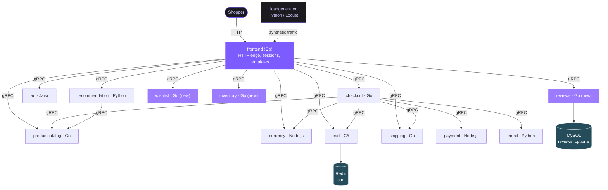
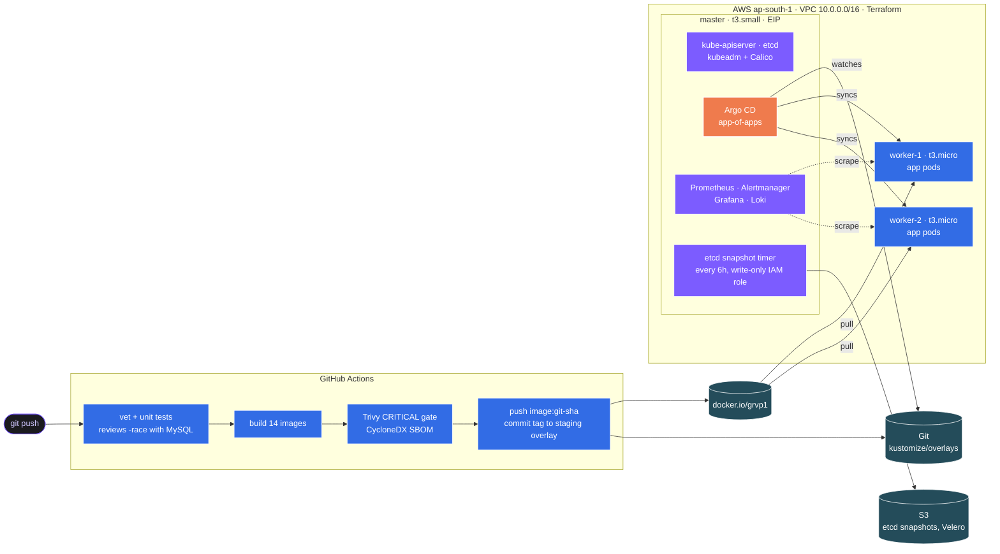
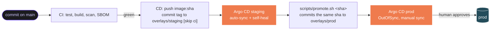

<h1 align="center">VANTA Boutique</h1>

<p align="center">
  <strong>Curated for the Bold.</strong> A dark-themed e-commerce storefront on a polyglot gRPC
  microservices app, with the complete delivery platform around it: Terraform, kubeadm, Argo CD,
  GitHub Actions, Prometheus. Everything is code.
</p>

<p align="center">
  <a href="#architecture"></a>
  <a href="#architecture"></a>
  <a href="/kustomize"></a>
  <a href="/terraform"></a>
  <a href="/argocd"></a>
  <a href="/monitoring"></a>
  <a href="/.github/workflows"></a>
  
</p>

---

## What this is

VANTA Boutique started as a fork of Google's [Online Boutique](https://github.com/GoogleCloudPlatform/microservices-demo)
demo. The application is theirs; the platform around it is the work in this repo:

- **Three new services** written from scratch in Go: reviews (MySQL-backed), wishlist, inventory.
- **A rebuilt storefront**: rupee-first pricing, 25-product catalog with search/filter/sort, stock
  states, product reviews with ratings, wishlist, real product photography.
- **A reproducible platform on AWS**: Terraform provisions the VPC and EC2 nodes, Ansible and
  kubeadm form the cluster, Argo CD delivers by pull-based GitOps, Prometheus/Grafana/Loki
  observe it, and etcd snapshots plus Velero back it up. An EKS variant of the same platform
  lives alongside.
- **A CI/CD pipeline** that tests, builds and scans all 14 images on every push, gates on
  CRITICAL CVEs, produces an SBOM per image, and promotes by committing immutable git-SHA
  tags into the staging overlay. CI never holds cluster credentials.

The storefront is 14 services in five languages (Go, C#, Node.js, Python, Java) talking gRPC.

## Screenshots

| Landing | Catalog: 25 products, 6 categories, filter/search/sort | Product detail with reviews |
| --- | --- | --- |
|  |  |  |

| Sold-out state | Cart and checkout | Order confirmed |
| --- | --- | --- |
|  |  |  |

## Architecture

The Go **frontend** is the only HTTP edge; every other service is an internal gRPC backend.
Services are stateless and scale horizontally. State lives in two stores: **Redis** for the
cart and an optional **MySQL** for reviews. **checkout** orchestrates an order by fanning out to
cart, catalog, currency, shipping, payment and email. Contracts are Protocol Buffers in
[`/protos`](/protos), generated per language.


```mermaid
flowchart TD
    user([Shopper]):::ext
    lg[loadgenerator<br/>Python / Locust]:::ext

    user -->|HTTP| fe
    lg -. synthetic traffic .-> fe

    fe["frontend (Go)<br/>HTTP edge, sessions, templates"]:::edge

    fe -->|gRPC| pc[productcatalog · Go]
    fe -->|gRPC| cur[currency · Node.js]
    fe -->|gRPC| cart[cart · C#]
    fe -->|gRPC| rec[recommendation · Python]
    fe -->|gRPC| ship[shipping · Go]
    fe -->|gRPC| ad[ad · Java]
    fe -->|gRPC| rev["reviews · Go (new)"]:::new
    fe -->|gRPC| wish["wishlist · Go (new)"]:::new
    fe -->|gRPC| inv["inventory · Go (new)"]:::new
    fe -->|gRPC| co[checkout · Go]

    co -->|gRPC| cart
    co -->|gRPC| pc
    co -->|gRPC| cur
    co -->|gRPC| ship
    co -->|gRPC| pay[payment · Node.js]
    co -->|gRPC| email[email · Python]

    rec -->|gRPC| pc

    cart --> redis[("Redis<br/>cart")]:::store
    rev --> mysql[("MySQL<br/>reviews, optional")]:::store

    classDef edge  fill:#7c5cff,stroke:#fff,color:#fff;
    classDef new   fill:#9d7bff,stroke:#fff,color:#fff,stroke-width:2px;
    classDef store fill:#244c5a,stroke:#fff,color:#fff;
    classDef ext   fill:#1b1b1f,stroke:#7c5cff,color:#cfc6ff;
```

Tracing to an OpenTelemetry collector is optional (`COLLECTOR_SERVICE_ADDR`, the `tracing`
Kustomize component) and is left out of the diagram to keep the request path readable.

| Service | Language | Role |
| --- | --- | --- |
| [frontend](/src/frontend) | Go | HTTP server for the store; a session per visitor, no login. Renders reviews, wishlist and stock. |
| [reviewsservice](/src/reviewsservice) | Go | **New.** Product reviews and aggregate ratings over gRPC. In-memory store by default, MySQL for multi-replica deployments, behind a `Store` interface. |
| [wishlistservice](/src/wishlistservice) | Go | **New.** Saved items keyed by session, so the list survives a cleared browser. Bounded per user and in total; the frontend falls back to `localStorage` when it is not deployed. |
| [inventoryservice](/src/inventoryservice) | Go | **New.** Stock levels behind "In stock", "Only 3 left" and "Sold out". Seeded from a built-in table or a mounted ConfigMap. |
| [cartservice](/src/cartservice) | C# | Cart items in Redis. |
| [productcatalogservice](/src/productcatalogservice) | Go | Product list, search, lookups. |
| [currencyservice](/src/currencyservice) | Node.js | Currency conversion (ECB rates). Highest QPS. |
| [paymentservice](/src/paymentservice) | Node.js | Mock card charge, returns a transaction ID. |
| [shippingservice](/src/shippingservice) | Go | Mock shipping quote and shipment. |
| [emailservice](/src/emailservice) | Python | Mock order-confirmation email. |
| [checkoutservice](/src/checkoutservice) | Go | Orchestrates cart, payment, shipping and email. |
| [recommendationservice](/src/recommendationservice) | Python | Recommendations from cart contents. |
| [adservice](/src/adservice) | Java | Contextual text ads. |
| [loadgenerator](/src/loadgenerator) | Python / Locust | Continuous synthetic shopping traffic. |

What the new services carry beyond the demo: graceful shutdown on `SIGTERM`, gRPC message-size
and keepalive limits, input validation and length caps, DB-connectivity-driven gRPC health,
`distroless:nonroot` images, and a NetworkPolicy each. The cloud-provider SDKs the upstream
demo shipped with (Cloud Profiler, GCE metadata detection, AlloyDB/Spanner/Secret Manager
stores) were removed from all services; every image is built here and runs from this repo's
registry namespace (`docker.io/grvp1`).

## Platform

Nothing is clicked in a console. The platform is provisioned once from code, then the
day-to-day loop is a Git commit.


```mermaid
flowchart LR
    dev([git push]):::ext

    subgraph ci["GitHub Actions"]
      direction LR
      test["vet + unit tests<br/>reviews -race with MySQL"] --> build["build 14 images"] --> scan["Trivy CRITICAL gate<br/>CycloneDX SBOM"] --> ship["push image:git-sha<br/>commit tag to staging overlay"]
    end

    reg[("docker.io/grvp1")]:::store
    git[("Git<br/>kustomize/overlays")]:::store
    s3[("S3<br/>etcd snapshots, Velero")]:::store

    subgraph aws["AWS ap-south-1 · VPC 10.0.0.0/16 · Terraform"]
      direction TB
      subgraph master["master · t3.small · EIP"]
        api["kube-apiserver · etcd<br/>kubeadm + Calico"]:::edge
        argo["Argo CD<br/>app-of-apps"]:::argo
        obs["Prometheus · Alertmanager<br/>Grafana · Loki"]:::edge
        snap["etcd snapshot timer<br/>every 6h, write-only IAM role"]:::edge
      end
      w1["worker-1 · t3.micro<br/>app pods"]:::node
      w2["worker-2 · t3.micro<br/>app pods"]:::node
    end

    dev --> test
    ship --> reg
    ship --> git
    argo -->|watches| git
    argo -->|syncs| w1
    argo -->|syncs| w2
    reg -->|pull| w1
    reg -->|pull| w2
    obs -.->|scrape| w1
    obs -.->|scrape| w2
    snap --> s3

    classDef edge  fill:#7c5cff,stroke:#fff,color:#fff;
    classDef argo  fill:#ef7b4d,stroke:#fff,color:#fff,stroke-width:2px;
    classDef node  fill:#326ce5,stroke:#fff,color:#fff;
    classDef store fill:#244c5a,stroke:#fff,color:#fff;
    classDef ext   fill:#1b1b1f,stroke:#7c5cff,color:#cfc6ff;
```

### Release path

Staging is automatic; prod needs a human. Rollback in either is `git revert`.


```mermaid
flowchart LR
    c([commit on main]):::ext --> ci["CI: test, build, scan, SBOM"]
    ci -->|green| cd["CD: push image:sha<br/>commit tag to overlays/staging [skip ci]"]
    cd --> st["Argo CD staging<br/>auto-sync + self-heal"]:::argo
    st --> pr["scripts/promote.sh &lt;sha&gt;<br/>commits the same sha to overlays/prod"]
    pr --> ps["Argo CD prod<br/>OutOfSync, manual sync"]:::argo
    ps -->|human approves| prod[("prod")]:::store

    classDef argo  fill:#ef7b4d,stroke:#fff,color:#fff;
    classDef store fill:#244c5a,stroke:#fff,color:#fff;
    classDef ext   fill:#1b1b1f,stroke:#7c5cff,color:#cfc6ff;
```

| Layer | What is here | Where |
| --- | --- | --- |
| Infrastructure | Terraform: VPC, public subnet, IGW, security groups, EIP, key pair, 1 master + 2 workers, an IAM role for etcd backups | [`/terraform`](/terraform) |
| Cluster | Ansible + kubeadm bootstrap, Calico CNI, an audit playbook | [`/ansible`](/ansible), [`scripts/bootstrap-k8s.sh`](/scripts/bootstrap-k8s.sh) |
| Manifests | Kustomize base, `dev`/`staging`/`prod`/`eks` overlays, composable components (ingress, TLS, network policies, PDBs, persistence, tracing) | [`/kustomize`](/kustomize) |
| GitOps | Argo CD app-of-apps: staging auto-syncs from CI-committed git-SHA tags; prod is manual sync | [`/argocd`](/argocd), [`scripts/promote.sh`](/scripts/promote.sh) |
| CI/CD | GitHub Actions: vet and tests, all 14 images, Trivy CRITICAL gate, SBOM, Kustomize and Helm render checks, `terraform validate` | [`/.github/workflows`](/.github/workflows) |
| Ingress and TLS | nginx Ingress with rate limits and timeouts; cert-manager with Let's Encrypt | [`components/ingress`](/kustomize/components/ingress), [`components/tls`](/kustomize/components/tls) |
| Observability | kube-prometheus-stack, 11 alert rules including a 99.5% availability SLO with multi-window burn-rate alerts, Alertmanager to Slack by severity, a Grafana dashboard, Loki | [`/monitoring`](/monitoring) |
| Security | RBAC, Pod Security admission, default-deny NetworkPolicies with per-service allow lists, least-privilege security groups, non-root distroless images, image scan gate, no secrets in Git | [`/scripts`](/scripts), [`components/network-policies`](/kustomize/components/network-policies) |
| Backup and DR | Git as source of truth; etcd snapshots to S3 every 6 hours from a systemd timer using a write-only IAM instance role; Velero file-system backups every 6 hours (48h retention); restore drill in the runbooks | [`scripts/etcd-backup-setup.sh`](/scripts/etcd-backup-setup.sh), [`terraform/iam-etcd-backup.tf`](/terraform/iam-etcd-backup.tf), [`/backup`](/backup) |
| Resilience | HPA (frontend, reviews), PodDisruptionBudgets, chaos and node-failover drills with runbooks | [`/scripts`](/scripts), [`docs/RUNBOOKS.md`](/docs/RUNBOOKS.md) |
| Packaging | A Helm chart as an alternative to the overlays, validated in CI | [`/helm-chart`](/helm-chart) |

The AWS footprint is about **$1.5/day** and tears down with `terraform destroy`. State,
kubeconfig, tfvars and credentials are git-ignored.

### Two deployment targets

| | Self-managed (primary) | EKS variant |
| --- | --- | --- |
| Terraform | [`/terraform`](/terraform): EC2 + kubeadm | [`/terraform-eks`](/terraform-eks): `terraform-aws-modules` VPC, EKS with access entries, managed node group, CoreDNS/kube-proxy/VPC CNI/EBS CSI add-ons, IRSA for EBS CSI and the Load Balancer Controller |
| Entry | nginx Ingress on a NodePort/EIP | ALB via the AWS Load Balancer Controller |
| Storage | local-path | EBS gp3 |
| Overlay | `kustomize/overlays/{staging,prod}` | `kustomize/overlays/eks` |
| Argo CD | `argocd/apps/*` (via the root app) | `argocd/eks/application.yaml`, registered by hand on the EKS cluster |
| Runbook | [docs/PLATFORM.md](/docs/PLATFORM.md) | [docs/EKS.md](/docs/EKS.md) |

kubeadm was chosen first to work with the control plane directly (certificates, etcd, CNI,
StorageClass). The EKS variant reuses the same overlays and images with managed control plane
and IAM-native access. See [docs/DECISIONS.md](/docs/DECISIONS.md) for the trade-offs.

## Repository map

```
.github/workflows/   ci-pipeline, cd-pipeline, kustomize/helm/terraform validation, deps-bump
ansible/             playbook.yml (kubeadm init/join + Calico), audit-playbook.yml
argocd/              root.yaml (app-of-apps) · apps/{dev,staging,prod}.yaml · eks/application.yaml
backup/              Velero install and example credentials file
docs/                PLATFORM (runbook) · RUNBOOKS · DECISIONS · EKS · development guide · migration guides
helm-chart/          alternative packaging, linted and rendered in CI
kustomize/           base/ (14 services) · components/ · overlays/{dev,staging,prod,eks,local,kind-ingress} · tests/
monitoring/          kube-prometheus-stack, Loki and ingress-nginx values; Grafana dashboard; alert rules
protos/              gRPC contracts (demo.proto, health)
scripts/             setup-argocd, install-ingress-nginx, promote, bump-image-tags, etcd-backup-setup,
                     failover-lab, chaos-engineering, health-check, eks-addons
src/                 14 services, one directory each, with Dockerfile and README
terraform/           kubeadm cluster on EC2        terraform-eks/   EKS variant
```

## Run it locally (kind)

A local [kind](https://kind.sigs.k8s.io/) cluster runs the whole store with no cloud account.

```sh
# 1. cluster (NodePort 30080 -> host 8888; 80/443 for the optional Ingress)
kind create cluster --config kind-local.yaml            # make kind-up

# 2. dev overlay: namespace `boutique`, all 14 services + Redis
kubectl apply -k kustomize/overlays/dev                 # make deploy
kubectl wait -n boutique --for=condition=ready pod --all --timeout=300s

# 3. open the store
#    http://localhost:8888          (NodePort)
kubectl port-forward -n boutique svc/frontend 8088:80   # or http://localhost:8088
```

With the real entry path (nginx Ingress and rate limits, as in prod):

```sh
scripts/install-ingress-nginx.sh --provider kind        # make ingress
kubectl apply -k kustomize/overlays/kind-ingress
echo "127.0.0.1 vanta.local" | sudo tee -a /etc/hosts    # http://vanta.local
```

Build a service from source and load it into kind:

```sh
docker build -t docker.io/grvp1/reviewsservice:dev src/reviewsservice
kind load docker-image docker.io/grvp1/reviewsservice:dev --name boutique
kubectl set image -n boutique deployment/reviewsservice server=docker.io/grvp1/reviewsservice:dev
```

To run reviews on MySQL instead of in memory, add the component to
`kustomize/overlays/dev/kustomization.yaml`:

```yaml
components:
  - ../../components/reviews-persistence
```

If you are upgrading a deployment that used the earlier PostgreSQL store, read
[the MySQL migration guide](docs/REVIEWS_MYSQL_MIGRATION.md) first; the image and the database
configuration have to be cut over together.

Other paths: the [platform runbook](/docs/PLATFORM.md) for AWS, [docs/EKS.md](/docs/EKS.md)
for EKS, [`/helm-chart`](/helm-chart) for Helm, and the
[development guide](/docs/development-guide.md) for the inner loop.

## Tech stack

- **Languages:** Go, C#, Node.js, Python, Java
- **Comms:** gRPC and Protocol Buffers, gRPC health protocol
- **Data:** Redis (cart), MySQL via go-sql-driver (reviews)
- **Packaging:** multi-stage Docker, `distroless:nonroot`
- **Infrastructure:** Terraform (AWS VPC, EC2; EKS variant with terraform-aws-modules), Ansible
- **Orchestration:** Kubernetes (kubeadm + Calico; EKS), Kustomize base/overlays/components, Helm
- **Ingress and TLS:** nginx Ingress, cert-manager
- **CI/CD and GitOps:** GitHub Actions (vet, `-race` tests with a MySQL service container, Trivy gate, CycloneDX SBOM), Argo CD app-of-apps, git-SHA image tags
- **Observability:** Prometheus, Alertmanager (Slack), Grafana, Loki, SLO burn-rate alerts
- **Backup and resilience:** etcd snapshots to S3, Velero, HPA, PDB, NetworkPolicies, chaos and failover drills

## Documentation

- [Platform runbook](/docs/PLATFORM.md): provision AWS, form the cluster, GitOps, observability, day-2.
- [EKS runbook](/docs/EKS.md): the managed-cluster variant.
- [Runbooks](/docs/RUNBOOKS.md): crash loops, rollback, node failover, DB down, SLO burn, TLS, restore drill.
- [Decisions](/docs/DECISIONS.md): why GitOps, SHA tags, scan gates, network policies, SLOs, kubeadm.
- [Development guide](/docs/development-guide.md), [CI/CD workflows](/.github/workflows/README.md), [Kustomize layout](/kustomize/README.md), [Helm chart](/helm-chart/README.md), [Monitoring](/monitoring/README.md)
- [Reviews](/src/reviewsservice/README.md), [Wishlist](/src/wishlistservice/README.md), [Inventory](/src/inventoryservice/README.md) service READMEs
- [Adding a new microservice](/docs/adding-new-microservice.md), with reviewsservice as the worked example
- [Reviews: PostgreSQL to MySQL](/docs/REVIEWS_MYSQL_MIGRATION.md), including the verification run
- [How this was built](/docs/learning-journey.md): minikube to a 3-node cluster on AWS

## Credits and license

Built on Google's [Online Boutique](https://github.com/GoogleCloudPlatform/microservices-demo),
Apache-2.0 (see [`LICENSE`](/LICENSE)). The reviews, wishlist and inventory services, the VANTA
storefront, and the platform and pipeline in this repo are additions by this project.

Product photography is from [Unsplash](https://unsplash.com) under the
[Unsplash License](https://unsplash.com/license); a few items use original SVG tiles.
