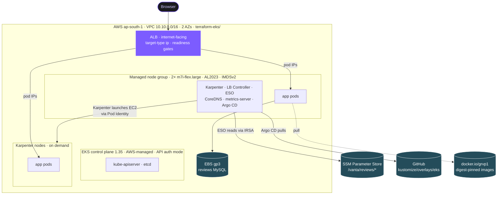

# EKS runbook

VANTA Boutique on Amazon EKS: the second deployment target next to the self-managed kubeadm
cluster. Same images, same Kustomize base, managed control plane.

Deployed and tested end to end on 2026-09-24 on EKS 1.35: 28/28 pods running, the store served
through an ALB, Karpenter scaling a node in, HPA scaling the frontend, and a node drain under
live traffic with zero failed requests. Every command below is the one that was actually run.

> **Cost.** Control plane $0.10/hr, 2 nodes, one NAT gateway and the ALB come to roughly
> $0.35-0.40/hr while it runs. Tear it down at the end of every session (see
> [Teardown](#teardown)). The control plane bills whether or not anything is deployed.

---

## Architecture



**Request path:** browser → ALB (public subnets) → frontend pod IP directly (VPC CNI gives pods
VPC addresses, so there is no NodePort hop) → gRPC backends over ClusterIP Services.

**Who can call AWS, and how:**

| Workload | AWS permission | Mechanism |
| --- | --- | --- |
| AWS Load Balancer Controller | create ALBs, target groups | IRSA |
| EBS CSI driver | create and attach EBS volumes | IRSA |
| External Secrets Operator | read `/vanta/*` in SSM, read-only | IRSA |
| Karpenter controller | launch and terminate EC2 | EKS Pod Identity |
| Nodes | ECR pull, VPC CNI, SSM | node IAM role |
| App pods | none | IMDSv2 hop limit 1 blocks the node role |

---

## What Terraform creates (`terraform-eks/`)

| Resource | Notes |
| --- | --- |
| VPC | 2 AZs, public + private subnets, one NAT gateway (lab), tags for the LB Controller and Karpenter discovery |
| EKS cluster | 1.35, `cluster_upgrade_policy = STANDARD`, `authentication_mode = API`, control-plane audit logs |
| Managed node group | 2× `m7i-flex.large` (min 2, max 3), AL2023, IMDSv2 required with hop limit 1, private subnets |
| Add-ons | CoreDNS, kube-proxy, VPC CNI (prefix delegation on), EBS CSI, Pod Identity agent |
| IRSA roles | EBS CSI, Load Balancer Controller, External Secrets Operator (`/vanta/*` read-only) |
| Karpenter | controller role (Pod Identity), node role + access entry, SQS interruption queue, 4 EventBridge rules |

State: `s3://gaurav-devops-tfstate/eks/terraform.tfstate`, locked with DynamoDB `terraform-lock`.

## What runs in the cluster

| Component | Installed by | Namespace |
| --- | --- | --- |
| AWS Load Balancer Controller | `scripts/eks-addons.sh` (Helm) | kube-system |
| metrics-server | Helm | kube-system |
| Argo CD | upstream `stable` manifest, server-side apply | argocd |
| External Secrets Operator | Helm | external-secrets |
| Karpenter 1.14.1 | Helm (OCI) + `karpenter/nodepool.yaml` | kube-system |
| The store (14 services, MySQL, Redis) | Argo CD Application `vanta-boutique-eks` | boutique |

The `boutique` namespace enforces Pod Security **restricted**; every Deployment runs with the
RuntimeDefault seccomp profile, a preStop hook and an ALB readiness gate (see
`kustomize/overlays/eks/`).

## kubeadm vs EKS

| Concern | kubeadm (`terraform/`) | EKS (`terraform-eks/`) |
| --- | --- | --- |
| Control plane | self-managed: etcd, certificates, upgrades | AWS-managed across 3 AZs |
| Access | client certificate in admin.conf | IAM identity mapped by an EKS access entry |
| CNI | Calico overlay | VPC CNI, pods get VPC IPs, prefix delegation |
| Entry | nginx Ingress on a NodePort | ALB, target-type ip |
| Storage | local-path (node-bound) | EBS gp3 via the CSI driver |
| Node scaling | fixed nodes | managed node group base + Karpenter |
| Secrets | plain Secret in the component (demo) | ESO from SSM Parameter Store |
| Pod to AWS | node instance role | IRSA / Pod Identity, IMDS blocked for pods |

---

## Prerequisites

- `terraform` >= 1.5, `kubectl`, `helm` >= 3, `aws` CLI v2
- The state bucket `gaurav-devops-tfstate` and lock table `terraform-lock` (shared with the kubeadm stack)
- Git Bash on Windows: prefix any AWS command whose argument starts with `/` with
  `MSYS_NO_PATHCONV=1`, otherwise Git Bash rewrites `/vanta/...` into a Windows path

Check the account before the first apply:

```sh
# Free Plan accounts can only launch Free Plan eligible instance types
aws freetier get-account-plan-state --region us-east-1
aws ec2 describe-instance-types --region ap-south-1 \
  --filters Name=free-tier-eligible,Values=true --query 'InstanceTypes[].InstanceType'

# pick a version that is in STANDARD support today; the Terraform refuses extended support
aws eks describe-cluster-versions --region ap-south-1 \
  --query 'clusterVersions[].[clusterVersion,versionStatus]' --output table
```

---

## Lab steps

Each step ends with a check. Do not move on until it passes.

### 1. Cluster

```sh
cd terraform-eks
terraform init
terraform plan -out=eks.plan      # read it: no "forces replacement", no destroy
terraform apply eks.plan          # ~15 min
aws eks update-kubeconfig --name online-boutique-eks --region ap-south-1
```

Check: `kubectl get nodes` shows 2 nodes `Ready` on 1.35, one per AZ.
`kubectl get nodes -o jsonpath='{.items[*].status.allocatable.pods}'` shows 110 per node
(prefix delegation; without it an m7i-flex.large takes about 29).

### 2. Load Balancer Controller and metrics-server

```sh
export LB_ROLE_ARN=$(terraform -chdir=terraform-eks output -raw lb_controller_role_arn)
export VPC_ID=$(terraform -chdir=terraform-eks output -raw vpc_id)
bash scripts/eks-addons.sh

helm repo add metrics-server https://kubernetes-sigs.github.io/metrics-server/
helm upgrade --install metrics-server metrics-server/metrics-server -n kube-system
```

Check: `kubectl -n kube-system get deploy aws-load-balancer-controller metrics-server` both
ready, and `kubectl top nodes` returns numbers (give metrics-server a minute).

### 3. Argo CD and the store

Do **not** run `scripts/setup-argocd.sh` here: it applies `argocd/root.yaml`, which would deploy
the dev, staging and prod overlays into this cluster. Install Argo CD on its own and register only
the EKS Application:

```sh
kubectl create namespace argocd
kubectl apply -n argocd --server-side \
  -f https://raw.githubusercontent.com/argoproj/argo-cd/stable/manifests/install.yaml
kubectl -n argocd rollout status deploy/argocd-server --timeout=300s

kubectl apply -f argocd/eks/application.yaml
# manual-sync app; trigger a sync without the argocd CLI:
kubectl -n argocd patch application vanta-boutique-eks --type merge \
  -p '{"operation":{"initiatedBy":{"username":"gaurav"},"sync":{"revision":"main","prune":true}}}'
```

Check: `kubectl -n boutique get pods` all Running, `kubectl -n boutique get ingress` shows the
ALB hostname, and `http://<alb-hostname>/` returns the store.

### 4. Secrets from SSM (External Secrets Operator)

The ESO role comes from step 1. Install ESO and write the two passwords (new random values; the
demo ones are in Git history and count as leaked):

```sh
helm repo add external-secrets https://charts.external-secrets.io
helm upgrade --install external-secrets external-secrets/external-secrets \
  -n external-secrets --create-namespace \
  --set "serviceAccount.annotations.eks\.amazonaws\.com/role-arn=$(terraform -chdir=terraform-eks output -raw eso_role_arn)"

MSYS_NO_PATHCONV=1 aws ssm put-parameter --region ap-south-1 --type SecureString \
  --name /vanta/reviews/mysql-password --value "$(openssl rand -hex 16)"
MSYS_NO_PATHCONV=1 aws ssm put-parameter --region ap-south-1 --type SecureString \
  --name /vanta/reviews/mysql-root-password --value "$(openssl rand -hex 16)"
```

The overlay deletes the component's plain-text Secret and `external-secrets.yaml` rebuilds it with
the same name and keys, so MySQL and reviewsservice need no change. Sync the Application again.

Check: `kubectl -n boutique get externalsecret reviews-mysql` shows `SecretSynced`, and the
Secret's owner is the ExternalSecret. MySQL only reads its password on first start, so on an
existing volume reset it once: scale `reviews-mysql` to 0, delete the `reviews-mysql` PVC, sync,
then `kubectl -n boutique rollout restart deploy/reviewsservice`. Posting a review then returns 302.

### 5. Karpenter

```sh
helm upgrade --install karpenter oci://public.ecr.aws/karpenter/karpenter --version 1.14.1 \
  -n kube-system \
  --set settings.clusterName=online-boutique-eks \
  --set settings.interruptionQueue=$(terraform -chdir=terraform-eks output -raw karpenter_queue_name) \
  --set replicas=1 \
  --set controller.resources.requests.cpu=200m \
  --set controller.resources.requests.memory=256Mi \
  --set controller.resources.limits.memory=512Mi --wait
kubectl apply -f karpenter/nodepool.yaml
```

Check: `kubectl get nodepool,ec2nodeclass` both `READY True`. To see it work, shrink the managed
node group so pods go Pending:

```sh
aws eks update-nodegroup-config --cluster-name online-boutique-eks \
  --nodegroup-name <nodegroup> --scaling-config minSize=2,maxSize=3,desiredSize=2 --region ap-south-1
kubectl get nodeclaims -w
```

A NodeClaim appears within seconds of a pod going Pending. Terraform cannot change the node
count: the EKS module ignores `desired_size` so it does not fight an autoscaler, which is why
the scaling commands go through the AWS CLI.

### 6. Security checks

```sh
# a privileged pod is refused at admission (namespace enforces restricted)
kubectl -n boutique run evil --image=busybox --restart=Never \
  --overrides='{"spec":{"containers":[{"name":"evil","image":"busybox","securityContext":{"privileged":true}}]}}'

# a pod cannot reach instance metadata (IMDSv2, hop limit 1)
kubectl run imds-test --rm -i --restart=Never --image=curlimages/curl:8.10.1 -- \
  curl -s -m 5 -X PUT http://169.254.169.254/latest/api/token \
  -H "X-aws-ec2-metadata-token-ttl-seconds: 60"

aws eks describe-cluster --name online-boutique-eks --region ap-south-1 \
  --query cluster.accessConfig.authenticationMode
```

Expected: `Forbidden: violates PodSecurity "restricted:latest"`, no token from IMDS, and `API`.

### 7. Load and HPA

```sh
kubectl -n boutique autoscale deployment frontend --cpu=50% --min=2 --max=8
kubectl -n default create deployment load --image=busybox:1.36 --replicas=6 -- \
  sh -c 'while true; do wget -q -O /dev/null http://frontend.boutique.svc.cluster.local/; done'
kubectl -n boutique get hpa frontend -w
```

The load pods live in `default` because `boutique` rejects anything that is not restricted-clean.
Delete the load Deployment when done. The HPA is created by hand for the test and is not in the
overlay yet.

### 8. HA drill

Keep traffic on the ALB while a frontend pod is killed and the node hosting the other frontend
pod is drained:

```sh
ALB=$(kubectl -n boutique get ingress boutique -o jsonpath='{.status.loadBalancer.ingress[0].hostname}')
while true; do curl -s -o /dev/null -m 5 -w '%{http_code}\n' "http://$ALB/"; sleep 0.3; done > ha.log &
kubectl -n boutique delete pod <one-frontend-pod>
kubectl drain <node-with-the-other-frontend> --ignore-daemonsets --delete-emptydir-data --timeout=130s
kill %1; sort ha.log | uniq -c
kubectl uncordon <node>
```

---

## Results

| Test | Result |
| --- | --- |
| Pods per node with prefix delegation | 110 (about 29 without) |
| Store through the ALB | HTTP 200, reviews write to MySQL on EBS gp3 |
| Karpenter | pod Pending → `c7i-flex.large` launched and Ready in seconds; picked the cheaper of the two allowed types that fit |
| HPA, frontend at 50% CPU | 2 → 3 → 5 replicas, settled at 50% |
| Privileged pod in `boutique` | rejected at admission |
| Pod to instance metadata | no token (hop limit 1), IMDSv1 401 |
| HA drill before the graceful-drain fix | 131/134 requests OK (one 502, two timeouts) |
| HA drill after the fix | 249/249 requests OK |

## Problems found on the way

| Symptom | Cause | Fix |
| --- | --- | --- |
| Node group `CREATE_FAILED`: instance type not eligible for Free Tier | the account is on the AWS Free Plan, which only launches Free Plan eligible types | `m7i-flex.large` (2 vCPU / 8 GiB, eligible) |
| `CreateCluster`: version 1.33 only supported under extended support | 1.33 left standard support on 2026-07-29; the STANDARD upgrade policy refused it | 1.35 |
| Plan error: `name_prefix` longer than 38 characters | the module builds the node role name from the node group name | fixed short role name |
| Node group would fail on 1.33+ | no Amazon Linux 2 AMIs from 1.33; module v20 still defaults to AL2 | `ami_type = AL2023_x86_64_STANDARD` |
| reviewsservice crash-loop looking for a PostgreSQL socket | the EKS overlay was pinned to an image from before the MySQL migration | copied prod's tags and digests into the overlay |
| Two pods Pending after deploy | CPU requests at 93-95% on two nodes | third node, later Karpenter |
| A second, internal NLB nobody used | the base's `frontend-external` Service is `type: LoadBalancer`; harmless `<pending>` on kubeadm, a real NLB on EKS | deleted in the EKS overlay |
| 502 and timeouts while draining a node | SIGTERM and removal from the ALB target group happen in parallel | preStop sleep, longer grace period, ALB readiness gate, 30s deregistration delay |
| `/vanta/...` rejected by SSM | Git Bash rewrote the path | `MSYS_NO_PATHCONV=1` |

## Known gaps

- `redis-cart` runs one replica with a `minAvailable: 1` PodDisruptionBudget, so it can never be
  evicted and a node drain never finishes (EKS force-evicts after 15 minutes during upgrades).
  Needs two replicas or a managed Redis.
- `reviews-mysql` and `wishlistservice` are single replicas; in production the database would be RDS Multi-AZ.
- Karpenter runs one replica in this lab to fit the nodes; production runs two.
- Under load, one currencyservice pod sat at its CPU limit while its twin was half idle: gRPC keeps
  long-lived HTTP/2 connections and kube-proxy balances connections, not requests. HPA on the
  frontend alone does not scale the system.
- The HPA is not in the overlay yet; when it moves to Git the Argo CD Application needs
  `ignoreDifferences` on `/spec/replicas`.
- On the Free Plan the NodePool is limited to two instance types and on-demand capacity.

---

## Teardown

Order matters: Karpenter's nodes and the ALB are created from inside the cluster, so Terraform
does not know about them and the VPC cannot be deleted while they exist.

```sh
kubectl -n boutique delete hpa frontend --ignore-not-found
kubectl delete nodepool default                              # Karpenter removes its own nodes
kubectl -n argocd delete application vanta-boutique-eks      # the store, its Ingress and the ALB
aws elbv2 describe-load-balancers --region ap-south-1 \
  --query 'LoadBalancers[].LoadBalancerName'                 # wait until this is empty
terraform -chdir=terraform-eks destroy
```

The gp3 StorageClass has `reclaimPolicy: Retain`, so EBS volumes outlive their PVCs (and the
cluster) on purpose. Resetting the MySQL volume in step 4 also leaves the old one behind. After
the destroy, list what is left and delete it once you are sure the data is not needed:

```sh
aws ec2 describe-volumes --region ap-south-1 --filters Name=status,Values=available \
  --query 'Volumes[].[VolumeId,Size,Tags[?Key==`kubernetes.io/created-for/pvc/name`]|[0].Value]' --output table
aws ec2 delete-volume --region ap-south-1 --volume-id <vol-id>
```

The SSM parameters cost nothing and can stay for the next session.

## Troubleshooting

**Ingress has no address.** Check the controller logs
(`kubectl -n kube-system logs deploy/aws-load-balancer-controller`), the `kubernetes.io/role/elb`
tag on the public subnets and the IRSA annotation on its ServiceAccount.

**PVC stays Pending.** `kubectl get sc` should show `gp3` as default; the class uses
`WaitForFirstConsumer`, so it only binds once a pod is scheduled.

**`kubectl` says Unauthorized after a rebuild.** Run `aws eks update-kubeconfig` again. With
`authentication_mode = API` only principals with an access entry can reach the cluster; the
aws-auth ConfigMap is ignored.

**Karpenter never launches a node.** `kubectl get ec2nodeclass default -o yaml` should show
`Ready=True`; if not, the subnets or the node security group are missing the
`karpenter.sh/discovery` tag. Karpenter v1 also needs `enable_v1_permissions = true` in the
Terraform module.

**A node drain hangs.** `kubectl get pdb -A` for a budget that allows zero disruptions, usually a
single-replica Deployment with `minAvailable: 1`.
